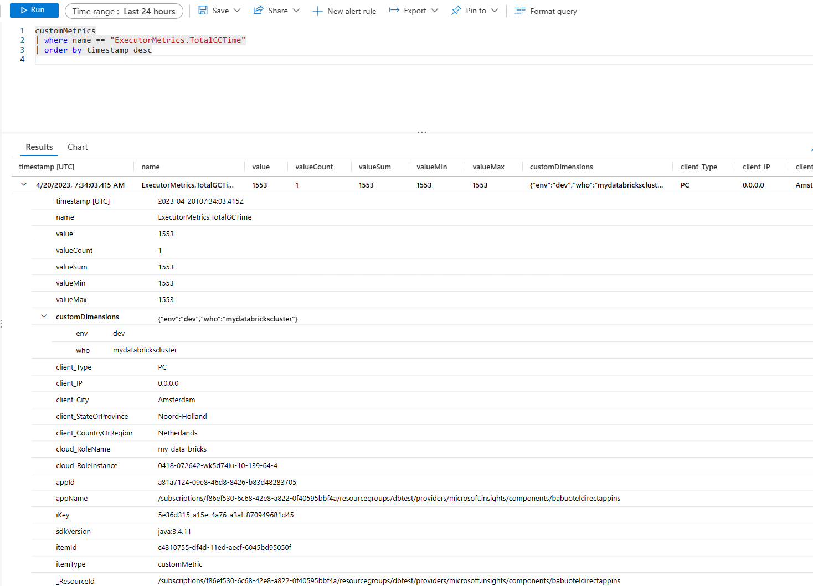
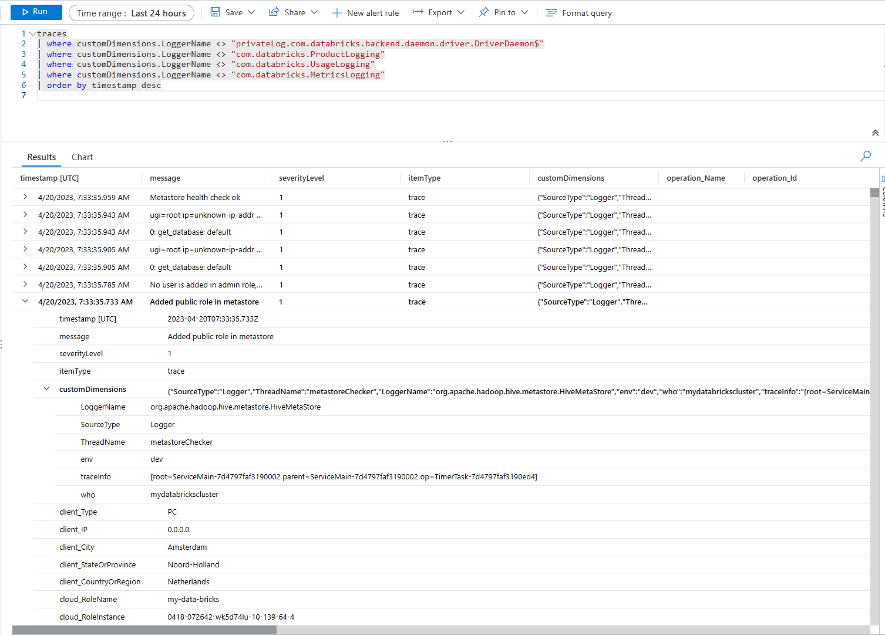

# Databricks observability demo

Download the latest [Application Insights Java agent JAR](https://github.com/microsoft/ApplicationInsights-Java/releases) to the project directory.

Rename the file to `applicationinsights-agent.jar`.

```shell
terraform init
terraform apply
```


## Outcomes

Sample metrics, e.g. for `ExecutorMetrics.TotalGCTime`:



As well as logs:



## More information

The configuration for the applicationinsights.json was initially generated with this [notebook](assets/dump-jmx-notebook.html).

Metrics from namespaces related to Logging and JDK internals were removed.

Metrics for the attribute `Value` were removed, since they were found to be always redundant with a metric named `Number` for the same MBean.
