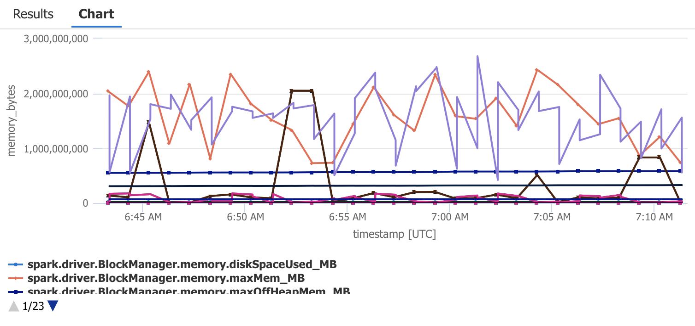
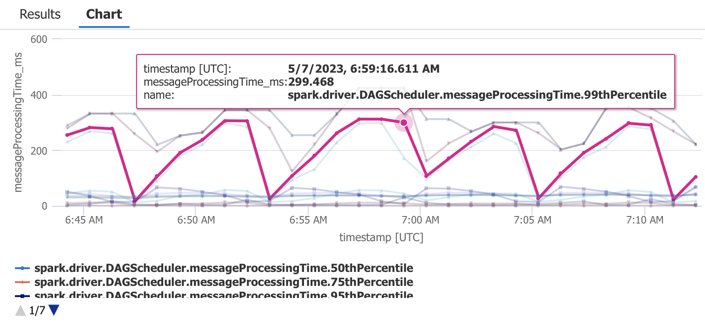

# Databricks observability demo

## Scope

This demo showcases:

- Configuring the [Azure Monitor OpenTelemetry Agent](https://learn.microsoft.com/azure/azure-monitor/app/opentelemetry-enable?tabs=net) for Databricks worker and executor Java processes
- Collecting detailed Spark metrics through JMX
- Collecting request traces to external services
- Collecting Spark logs

Future scope:

- Collecting streaming metrics
- Collecting custom metrics
- Collecting custom Python logs and spans
- Automatically deployed Azure Monitor Workbook or Dashboard

The demo is automated and can be deployed using Terraform with a single command.

## Deploying the solution

Download the latest [Application Insights Java agent JAR](https://github.com/microsoft/ApplicationInsights-Java/releases) to the project directory.

Rename the file to `applicationinsights-agent.jar`.

Run:

```shell
terraform init
terraform apply
```

⚠️ This sets up a cluster of two nodes, and a recurring job every minute, so that the cluster never automatically shuts down. This will incur high costs if you forget to tear down the resources!

## About the solution

### Overview

The solution deploys Azure Databricks connected to Azure Application Insights for monitoring via the [Spark JMX Sink](https://spark.apache.org/docs/latest/monitoring.html). A Databricks job runs periodically and is set up to fail about 50% of the time, to provide "interesting" logs.

The cluster is configured to use an external Hive metastore in Azure SQL Database.

### Init script

The solution contains a cluster node initialization script that generates a configuration file for the agent, based on [templates](modules/adb) in the solution.

Spark JMX MBeans on executor nodes are [prefixed with a configurable namespace named followed by the executor ID](https://github.com/apache/spark/blob/04816474bfcc05c7d90f7b7e8d35184d95c78cbd/core/src/main/scala/org/apache/spark/metrics/MetricsSystem.scala#L131), which is a different number on on every worker node. The Azure Monitor agent [does not allow regular expressions](https://learn.microsoft.com/en-us/azure/azure-monitor/app/java-jmx-metrics-configuration#types-of-collected-metrics-and-available-configuration-options) when defining JMX beans to monitor, and init scripts cannot know which executor ID will be assigned to the node they run on. Therefore, as a workaround, the agent configuration collects data for each MBean numbered up to the maximum number of nodes in the cluster. This value must be passed as the `MAX_WORKERS` cluster environment variable.

For example, for the JMX metrics MBean named with the pattern `metrics:name=spark.<executorId>.executor.threadpool.startedTasks,type=gauges` , if `MAX_WORKERS=3`, the agent is configured on every executor node to monitor the MBeans:

```
metrics:name=spark.0.executor.threadpool.startedTasks,type=gauges
metrics:name=spark.1.executor.threadpool.startedTasks,type=gauges
metrics:name=spark.2.executor.threadpool.startedTasks,type=gauges
```

All MBeans are set up to report the same Application Insights metric name:

```
spark.worker.executor.threadpool.startedTasks
```

The agent ignores metrics for non-existing MBeans on each worker. Each executor agent reports its metric correctly under the common Application Insights metric name, so that the values can be tallied up.

## Logs and Metrics

In the [Azure Portal](https://portal.azure.com/#view/HubsExtension/BrowseResource/resourceType/microsoft.insights%2Fcomponents), open the deployed Application Insights resource. Open the `Logs` pane.

Run the sample queries provided to visualize different metrics and logs.

### Tasks

```kql
customMetrics
| where name endswith 'Tasks'
| render timechart
```


### Memory

```kql
customMetrics
| where name startswith "spark"
| where name contains 'Memory'
| project-rename memory_bytes = value
| render timechart
```



```kql
customMetrics
| extend ip = iif(tobool(customDimensions["DB_IS_DRIVER"]), "driver", customDimensions["DB_CONTAINER_IP"])
| where name in ('spark.driver.ExecutorMetrics.OnHeapUnifiedMemory', 'spark.worker.ExecutorMetrics.OnHeapUnifiedMemory')
| project timestamp, ip, heap_memory_bytes = value
| render timechart
```


### Message processing time

```kql
customMetrics
| where name contains "messageProcessingTime"
| project-rename messageProcessingTime_ms = value
| where not(name contains "count")
| render timechart
```



### Logs

```kql
traces
```


### Application Map

In Application Insights, open the `Application Map` pane.


## More information

The configuration for the `applicationinsights.json` files was initially generated with this [notebook](assets/dump-jmx.ipynb) to collect MBean information from each cluster node.

## Authors

- Bastian Burger
- Alexandre Gattiker
